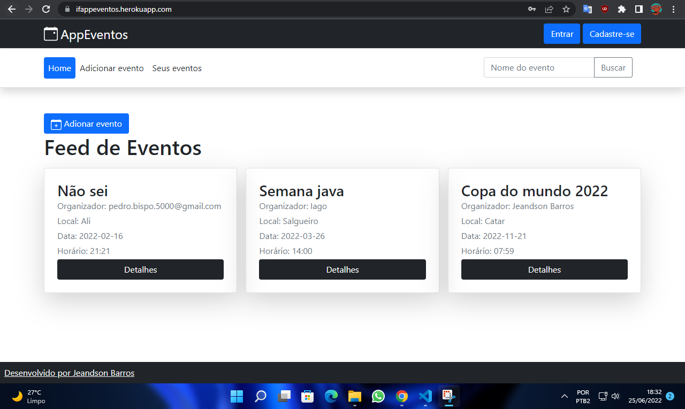

# AppEventos
Site do AppEventos: https://ifappeventos.herokuapp.com/

## Descrição do Projeto
Site para gerenciamento de eventos, desenvolvido com Spring Boot+BootsTrap.

O objetivo do projeto é permitir a criação, listagem, adição, exclusão de eventos, manipulação dos convidados dos eventos e autenticação. 

## Orientação para execução

É necessário a passar as informações de conexão do banco de dados no arquivo application.properties.

Exemplo:

`spring.datasource.url=jdbc:mysql://localhost:3306/appeventos`
`spring.datasource.username= root`
`spring.datasource.password=`  
`spring.datasource.driver-class-name=com.mysql.cj.jdbc.Driver`
`spring.jpa.database-platform = org.hibernate.dialect.MySQL8Dialect`
`spring.jpa.generate-ddl=true`
